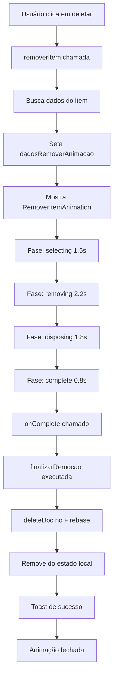

# 🗑️ Guia de Integração - RemoverItemAnimation

## 📋 Visão Geral

A `RemoverItemAnimation` é uma animação sofisticada que mostra o processo completo de remoção de um item do inventário, com:

- **Seleção visual** com partículas amarelas pulsantes
- **Remoção do almoxarifado** com ondas vermelhas e X piscante
- **Descarte na lixeira** com chamas e efeitos de queima
- **Explosão final** com X's vermelhos e alertas voando

**Duração total:** ~6.8 segundos

---

## 🎯 Onde Integrar

A animação deve ser integrada no componente que gerencia a exclusão de itens do inventário. Existem duas opções:

### Opção 1: InventarioTab.jsx (RECOMENDADO)
Integrar no componente pai que gerencia todos os itens

### Opção 2: ItemCard.jsx
Integrar diretamente no componente do card (menos flexível)

---

## 📦 Passo 1: Importar o Componente

No arquivo `src/pages/Inventario/InventarioTab.jsx`, adicione:

```jsx
import RemoverItemAnimation from '../../components/Animacoes/RemoverItemAnimation';
```

---

## 🔧 Passo 2: Adicionar Estados

Adicione estes estados no início do componente (após os outros estados existentes):

```jsx
const [showRemoverAnimation, setShowRemoverAnimation] = useState(false);
const [dadosRemoverAnimacao, setDadosRemoverAnimacao] = useState(null);
```

---

## ⚙️ Passo 3: Modificar a Função de Remoção

Encontre a função `removerItem` (aproximadamente na linha 27) e substitua por:

```jsx
const removerItem = async (id) => {
  try {
    // Encontrar o item que será removido
    const itemParaRemover = inventario.find(item => item.id === id);
    
    if (!itemParaRemover) {
      toast.error('Item não encontrado');
      return;
    }

    // Preparar dados para animação
    const dadosAnimacao = {
      nome: itemParaRemover.nome,
      quantidade: itemParaRemover.disponivel,
      categoria: itemParaRemover.categoria,
    };

    // Guardar ID para deletar depois
    setDadosRemoverAnimacao({ ...dadosAnimacao, id });
    
    // Mostrar animação
    setShowRemoverAnimation(true);
  } catch (error) {
    console.error('Erro ao preparar remoção:', error);
    toast.error('Erro ao remover item');
  }
};
```

---

## ✅ Passo 4: Criar Função de Finalização

Adicione esta nova função logo após `removerItem`:

```jsx
const finalizarRemocao = async () => {
  try {
    if (!dadosRemoverAnimacao?.id) {
      throw new Error('ID do item não encontrado');
    }

    // Deletar do Firestore
    await deleteDoc(doc(db, 'inventario', dadosRemoverAnimacao.id));
    
    // Atualizar estado local
    setInventario(prev => prev.filter(item => item.id !== dadosRemoverAnimacao.id));
    
    // Fechar animação
    setShowRemoverAnimation(false);
    setDadosRemoverAnimacao(null);
    
    // Mostrar sucesso
    toast.success(`${dadosRemoverAnimacao.nome} removido com sucesso!`);
  } catch (error) {
    console.error('Erro ao finalizar remoção:', error);
    toast.error('Erro ao remover item do sistema');
    
    // Fechar animação mesmo com erro
    setShowRemoverAnimation(false);
    setDadosRemoverAnimacao(null);
  }
};
```

---

## 🎨 Passo 5: Renderizar a Animação

No final do JSX do componente (antes do fechamento do fragment `</>`), adicione:

```jsx
{/* Animação de Remoção */}
{showRemoverAnimation && dadosRemoverAnimacao && (
  <RemoverItemAnimation
    item={dadosRemoverAnimacao}
    onComplete={finalizarRemocao}
  />
)}
```

---

## 📍 Localização Exata no Código

### Imports (início do arquivo):
```jsx
import React, { useState, useEffect } from 'react';
import { collection, getDocs, deleteDoc, doc } from 'firebase/firestore';
import { db } from '../../firebase';
import { toast } from 'sonner';
import RemoverItemAnimation from '../../components/Animacoes/RemoverItemAnimation'; // ← ADICIONAR
```

### Estados (após estados existentes):
```jsx
const [inventario, setInventario] = useState([]);
const [loading, setLoading] = useState(true);
const [showRemoverAnimation, setShowRemoverAnimation] = useState(false); // ← ADICIONAR
const [dadosRemoverAnimacao, setDadosRemoverAnimacao] = useState(null); // ← ADICIONAR
```

### Renderização (antes do `</>` final):
```jsx
return (
  <div>
    {/* ... todo o conteúdo existente ... */}
    
    {/* Animação de Remoção - ADICIONAR */}
    {showRemoverAnimation && dadosRemoverAnimacao && (
      <RemoverItemAnimation
        item={dadosRemoverAnimacao}
        onComplete={finalizarRemocao}
      />
    )}
  </div>
);
```

---

## 🧪 Como Testar

1. **Clique no ícone de lixeira** em qualquer item do inventário
2. **Veja a animação completa:**
   - ✨ Seleção com partículas amarelas (1.5s)
   - 🚫 Remoção com ondas vermelhas e X piscante (2.2s)
   - 🔥 Descarte na lixeira com chamas (1.8s)
   - 💥 Explosão final com X's e alertas (0.8s)
3. **Verifique se o item foi deletado** do Firebase e da UI
4. **Confirme o toast de sucesso**

---

## 🎭 Fases da Animação

| Fase | Duração | Descrição |
|------|---------|-----------|
| **start** | 0.5s | Preparação inicial |
| **selecting** | 1.5s | Seleção do item com partículas amarelas |
| **removing** | 2.2s | Remoção do almoxarifado com ondas vermelhas |
| **disposing** | 1.8s | Descarte na lixeira com chamas |
| **complete** | 0.8s | Explosão final com X's vermelhos |
| **TOTAL** | **6.8s** | Duração completa |

---

## 🎯 Props da Animação

```typescript
interface RemoverItemAnimationProps {
  item: {
    nome: string;        // Nome do item
    quantidade: number;  // Quantidade sendo removida
    categoria?: string;  // Categoria (opcional)
  };
  onComplete: () => void; // Callback executado ao finalizar
}
```

---

## 🚨 Importante

- ⚠️ **NÃO DELETE diretamente do Firebase** - deixe a função `finalizarRemocao` fazer isso
- ⚠️ **NÃO mostre modal de confirmação** - a animação já serve como feedback visual forte
- ⚠️ **NÃO interrompa a animação** - ela precisa completar para chamar `onComplete`
- ⚠️ **Guarde o ID** no estado `dadosRemoverAnimacao` para deletar depois

---

## 🐛 Troubleshooting

### Problema: Animação não aparece
**Solução:** Verifique se `showRemoverAnimation` está sendo setado como `true`

### Problema: Item não é deletado
**Solução:** Verifique se `finalizarRemocao` está sendo chamada em `onComplete`

### Problema: Erro ao deletar do Firebase
**Solução:** Verifique se o ID está sendo guardado corretamente em `dadosRemoverAnimacao.id`

### Problema: Toast não aparece
**Solução:** Verifique se o `toast` está importado de `sonner`

---

## 📊 Estatísticas da Animação

- **Linhas de código:** 473
- **Componentes Lucide usados:** 7 (Package, Warehouse, XCircle, Trash2, AlertTriangle, Flame, X)
- **Partículas totais:** 38 (8 seleção + 30 remoção)
- **Efeitos especiais:** 11 (ondas, chamas, explosões, X's voadores)
- **Gradientes:** 8
- **Transições spring:** 3

---

## ✨ Features Destacadas

### 1. **Seleção Visual Sofisticada**
- 8 partículas amarelas orbitando o item
- Pulsação do card
- Indicação clara de qual item será removido

### 2. **Remoção Dramática**
- Ondas vermelhas saindo do almoxarifado
- X vermelho piscante sobre o item
- 30 partículas vermelhas explodindo
- Item se movendo e desaparecendo

### 3. **Descarte com Chamas**
- 8 chamas subindo da lixeira
- Efeitos de queima
- Ondas laranja de descarte

### 4. **Explosão Final Épica**
- 40 X's vermelhos explodindo
- 20 ícones de alerta voando
- Confirmação visual forte

### 5. **Feedback Visual Completo**
- Banner de alerta vermelho
- Detalhes do item riscados
- Barra de progresso vermelha
- X's nos containers

---

## 🎨 Paleta de Cores

| Elemento | Cor | Uso |
|----------|-----|-----|
| Almoxarifado | Cinza | Container neutro |
| Seleção | Amarelo | Identificação |
| Remoção | Vermelho | Alerta/Ação |
| Lixeira | Vermelho Escuro | Descarte |
| Chamas | Laranja | Queima |
| X's | Vermelho | Cancelamento |

---

## 🔄 Fluxo Completo



---

## 🎬 Exemplo de Uso Completo

```jsx
// InventarioTab.jsx
import React, { useState, useEffect } from 'react';
import { collection, getDocs, deleteDoc, doc } from 'firebase/firestore';
import { db } from '../../firebase';
import { toast } from 'sonner';
import RemoverItemAnimation from '../../components/Animacoes/RemoverItemAnimation';

const InventarioTab = () => {
  const [inventario, setInventario] = useState([]);
  const [showRemoverAnimation, setShowRemoverAnimation] = useState(false);
  const [dadosRemoverAnimacao, setDadosRemoverAnimacao] = useState(null);

  const removerItem = async (id) => {
    const itemParaRemover = inventario.find(item => item.id === id);
    if (!itemParaRemover) {
      toast.error('Item não encontrado');
      return;
    }

    setDadosRemoverAnimacao({
      nome: itemParaRemover.nome,
      quantidade: itemParaRemover.disponivel,
      categoria: itemParaRemover.categoria,
      id
    });
    
    setShowRemoverAnimation(true);
  };

  const finalizarRemocao = async () => {
    try {
      await deleteDoc(doc(db, 'inventario', dadosRemoverAnimacao.id));
      setInventario(prev => prev.filter(item => item.id !== dadosRemoverAnimacao.id));
      setShowRemoverAnimation(false);
      setDadosRemoverAnimacao(null);
      toast.success(`${dadosRemoverAnimacao.nome} removido com sucesso!`);
    } catch (error) {
      console.error('Erro:', error);
      toast.error('Erro ao remover item');
      setShowRemoverAnimation(false);
      setDadosRemoverAnimacao(null);
    }
  };

  return (
    <div>
      {/* ... conteúdo do inventário ... */}
      
      {showRemoverAnimation && dadosRemoverAnimacao && (
        <RemoverItemAnimation
          item={dadosRemoverAnimacao}
          onComplete={finalizarRemocao}
        />
      )}
    </div>
  );
};
```

---

## 🎉 Resultado Final

Quando o usuário clicar no botão de deletar:

1. ✨ **Animação épica de 6.8 segundos** mostrando todo o processo
2. 🗑️ **Remoção visual dramática** com partículas, chamas e explosões
3. 🔥 **Feedback forte** sobre a ação irreversível
4. ✅ **Deletion real** do Firebase após a animação
5. 📢 **Toast de confirmação** ao finalizar

---

**Criado em:** $(date)
**Versão:** 1.0.0
**Animação:** RemoverItemAnimation.jsx
