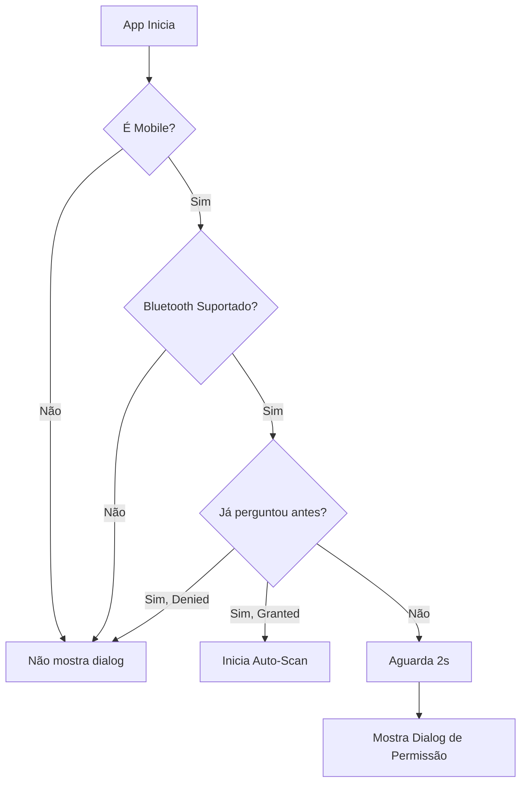
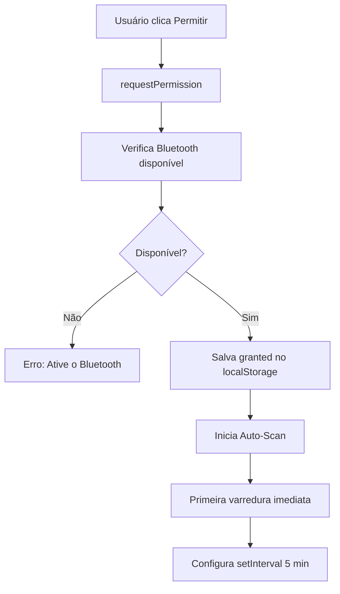
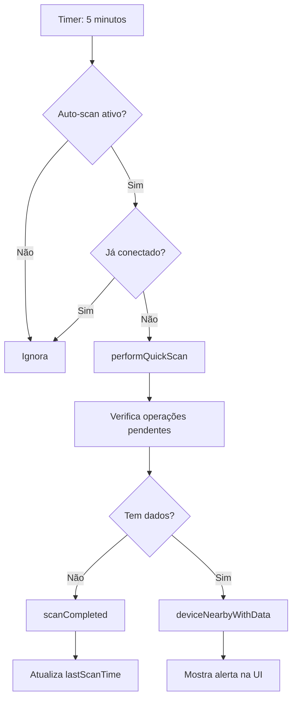
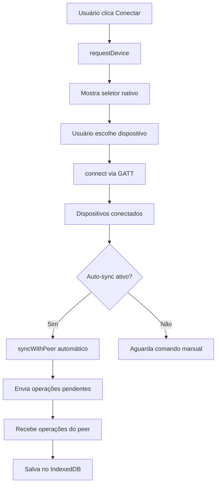

# Sistema de Bluetooth Mesh com Auto-Scan e Permissões

## 📱 Visão Geral

Sistema completo de sincronização P2P via Bluetooth implementado no Workflow, com suporte para:
- ✅ Detecção automática de dispositivos móveis (Android/iOS)
- ✅ Solicitação de permissão de Bluetooth ao iniciar app
- ✅ Varredura automática a cada 5 minutos
- ✅ Notificação quando dispositivos próximos têm dados para sincronizar
- ✅ Interface visual completa para gerenciamento

## 🏗️ Arquitetura do Sistema

### 1. Serviço Principal: `bluetoothMeshService.js`

**Localização:** `src/services/bluetoothMeshService.js`

#### Propriedades de Varredura Automática
```javascript
// Controle de varredura
this.autoScanEnabled = false;
this.scanInterval = null;
this.SCAN_INTERVAL_MS = 5 * 60 * 1000; // 5 minutos

// Detecção de plataforma
this.isMobile = this.detectMobile();
this.permissionGranted = false;
```

#### Métodos Principais

##### `detectMobile()`
Detecta se o dispositivo é móvel (Android/iOS/iPadOS):
```javascript
detectMobile() {
  const userAgent = navigator.userAgent || navigator.vendor || window.opera;
  return /android|webos|iphone|ipad|ipod|blackberry|iemobile|opera mini/i.test(
    userAgent.toLowerCase()
  );
}
```

##### `requestPermission()`
Solicita permissão de Bluetooth (especialmente importante em mobile):
```javascript
async requestPermission() {
  if (!this.isSupported) {
    throw new Error('Bluetooth não é suportado neste dispositivo');
  }
  
  const available = await this.isBluetoothAvailable();
  if (!available) {
    throw new Error('Bluetooth não está disponível. Ative nas configurações.');
  }
  
  this.notifyListeners('permissionRequested');
  return true;
}
```

##### `startAutoScan()`
Inicia varredura automática a cada 5 minutos:
```javascript
startAutoScan() {
  if (!this.isSupported || this.autoScanEnabled) return;
  
  console.log('🔍 Iniciando varredura automática (a cada 5 minutos)...');
  this.autoScanEnabled = true;
  
  // Primeira varredura imediata
  this.performQuickScan();
  
  // Varreduras periódicas
  this.scanInterval = setInterval(() => {
    if (this.autoScanEnabled && !this.isConnected) {
      this.performQuickScan();
    }
  }, this.SCAN_INTERVAL_MS);
  
  this.notifyListeners('autoScanStarted');
}
```

##### `stopAutoScan()`
Para a varredura automática:
```javascript
stopAutoScan() {
  if (this.scanInterval) {
    clearInterval(this.scanInterval);
    this.scanInterval = null;
  }
  this.autoScanEnabled = false;
  this.notifyListeners('autoScanStopped');
}
```

##### `performQuickScan()`
Executa varredura rápida e verifica operações pendentes:
```javascript
async performQuickScan() {
  if (!this.isSupported || this.isConnected) return;
  
  try {
    console.log('📡 Varredura rápida iniciada...');
    this.notifyListeners('scanStarted');
    
    // Web Bluetooth não permite varredura passiva em background
    // Solução: Verificar operações pendentes localmente
    const { default: offlineService } = await import('./offlineService');
    const pendingCount = await offlineService.getPendingCount();
    
    if (pendingCount > 0) {
      console.log(`📦 ${pendingCount} operações pendentes detectadas`);
      this.notifyListeners('deviceNearbyWithData', { 
        pendingCount,
        message: 'Dispositivos próximos podem ter dados para sincronizar'
      });
    }
    
    this.notifyListeners('scanCompleted');
  } catch (error) {
    console.error('❌ Erro na varredura:', error);
    this.notifyListeners('scanError', { error: error.message });
  }
}
```

##### `autoConnectIfAvailable()`
Reconecta automaticamente a dispositivos conhecidos:
```javascript
async autoConnectIfAvailable() {
  if (!this.autoSync || this.isConnected) return;
  
  try {
    if (this.device && !this.device.gatt.connected) {
      console.log('🔄 Tentando reconectar ao dispositivo anterior...');
      await this.connect();
    }
  } catch (error) {
    console.log('ℹ️ Reconexão automática não disponível:', error.message);
  }
}
```

#### Eventos Emitidos
O serviço emite os seguintes eventos para listeners:

| Evento | Quando | Dados |
|--------|--------|-------|
| `permissionRequested` | Permissão solicitada | - |
| `autoScanStarted` | Varredura automática iniciada | - |
| `autoScanStopped` | Varredura automática parada | - |
| `scanStarted` | Varredura iniciada | - |
| `scanCompleted` | Varredura concluída | - |
| `deviceNearbyWithData` | Dados detectados próximos | `{ pendingCount, message }` |
| `scanError` | Erro na varredura | `{ error }` |

### 2. Hook React: `useBluetoothMesh.js`

**Localização:** `src/hooks/useBluetoothMesh.js`

#### Estados Adicionados
```javascript
// Estados de varredura automática
const [isAutoScanEnabled, setIsAutoScanEnabled] = useState(false);
const [lastScanTime, setLastScanTime] = useState(null);
const [pendingDataNearby, setPendingDataNearby] = useState(null);
```

#### Novos Métodos Expostos
```javascript
return {
  // ... estados existentes
  
  // Estados de varredura
  isAutoScanEnabled,
  lastScanTime,
  pendingDataNearby,
  
  // Ações de varredura
  startAutoScan,        // Inicia varredura automática
  stopAutoScan,         // Para varredura automática
  performQuickScan      // Varredura manual única
};
```

#### Listener de Eventos
O hook escuta automaticamente os eventos do serviço:
```javascript
switch (event) {
  case 'autoScanStarted':
    setIsAutoScanEnabled(true);
    break;
    
  case 'autoScanStopped':
    setIsAutoScanEnabled(false);
    break;
    
  case 'scanCompleted':
    setLastScanTime(new Date());
    break;
    
  case 'deviceNearbyWithData':
    setPendingDataNearby(data);
    break;
}
```

### 3. Componente de Permissão: `BluetoothPermissionRequest.jsx`

**Localização:** `src/components/Bluetooth/BluetoothPermissionRequest.jsx`

#### Funcionalidade
- **Aparece apenas uma vez** ao iniciar o app em dispositivos móveis
- **Solicita permissão** para usar Bluetooth
- **Inicia auto-scan** se permissão concedida
- **Armazena escolha** em localStorage

#### Lógica de Exibição
```javascript
useEffect(() => {
  const checkAndRequest = async () => {
    const hasAsked = localStorage.getItem('bluetooth-permission-asked');
    const isMobile = bluetoothMeshService.isMobile;
    const isSupported = bluetoothMeshService.isSupported;

    if (!hasAsked && isMobile && isSupported) {
      // Aguardar 2 segundos para app carregar
      setTimeout(() => {
        setShowRequest(true);
      }, 2000);
    } else if (hasAsked === 'granted') {
      // Já concedida? Iniciar auto-scan
      bluetoothMeshService.startAutoScan();
    }
  };

  checkAndRequest();
}, []);
```

#### Opções do Usuário

**1. Permitir Bluetooth** ✅
```javascript
const handleAllow = async () => {
  await bluetoothMeshService.requestPermission();
  localStorage.setItem('bluetooth-permission-asked', 'granted');
  bluetoothMeshService.startAutoScan();
  setShowRequest(false);
};
```
- Solicita permissão do sistema
- Marca como concedida
- Inicia varredura automática
- Fecha o dialog

**2. Perguntar Depois** ⏰
```javascript
const handleLater = () => {
  // NÃO marca como solicitado
  setShowRequest(false);
};
```
- Apenas fecha o dialog
- Perguntará novamente na próxima abertura

**3. Não Permitir** ❌
```javascript
const handleDeny = () => {
  localStorage.setItem('bluetooth-permission-asked', 'denied');
  setShowRequest(false);
};
```
- Marca como negada
- Não pergunta mais (até usuário limpar localStorage)

#### Design Visual
- **Modal em tela cheia** com fundo escuro semi-transparente
- **Ícone de Bluetooth** animado no topo
- **Gradiente azul-roxo** no header
- **3 benefícios listados** com ícones:
  - 📡 Sincronização automática
  - 🔄 Compartilhar dados offline
  - 💾 Backup automático
- **Nota de privacidade** explicando que é seguro
- **Animações suaves** de entrada (fade-in + slide-up)

### 4. Interface de Gerenciamento: `BluetoothMeshManager.jsx`

**Localização:** `src/components/Bluetooth/BluetoothMeshManager.jsx`

#### Novas Funcionalidades Adicionadas

##### Toggle de Varredura Automática
```jsx
<div className="flex items-center justify-between bg-gray-50 dark:bg-gray-900 rounded-lg p-3">
  <div className="flex-1">
    <div className="text-sm font-medium">Varredura automática</div>
    <div className="text-xs text-gray-500">Busca dispositivos a cada 5 minutos</div>
  </div>
  <button
    onClick={isAutoScanEnabled ? stopAutoScan : startAutoScan}
    className={`
      relative inline-flex h-6 w-11 items-center rounded-full
      ${isAutoScanEnabled ? 'bg-green-600' : 'bg-gray-300'}
    `}
  >
    {/* Switch toggle */}
  </button>
</div>
```

##### Informação de Última Varredura
```jsx
<div className="flex justify-between">
  <span>Última varredura:</span>
  <span>{lastScanTime ? formatLastSync(lastScanTime) : 'Nunca'}</span>
</div>
```

##### Alerta de Dados Próximos
```jsx
{pendingDataNearby && (
  <div className="bg-blue-50 border border-blue-200 rounded-lg p-3">
    <div className="flex items-start gap-2">
      <span>📱</span>
      <div>
        <div className="font-medium">Dados disponíveis para sincronizar</div>
        <div className="text-xs">
          {pendingDataNearby.pendingCount} operações pendentes detectadas
        </div>
      </div>
    </div>
  </div>
)}
```

##### Botão de Varredura Rápida
```jsx
<button
  onClick={async () => {
    await performQuickScan();
  }}
  disabled={isScanning}
  className="bg-purple-500 hover:bg-purple-600 text-white"
>
  {isScanning ? '🔍 Varrendo...' : '🔍 Fazer Varredura Rápida'}
</button>
```

## 🔄 Fluxo de Funcionamento

### 1️⃣ Inicialização do App (Mobile)



### 2️⃣ Usuário Concede Permissão



### 3️⃣ Varredura Automática



### 4️⃣ Sincronização P2P



## 📊 Estatísticas e Monitoramento

### Estados Rastreados
```javascript
{
  isSupported: boolean,          // Bluetooth suportado?
  isConnected: boolean,          // Conectado a peer?
  connectedDevice: string,       // Nome do dispositivo
  isScanning: boolean,           // Varrendo agora?
  isSyncing: boolean,            // Sincronizando agora?
  lastSyncTime: Date,            // Última sincronização
  lastScanTime: Date,            // Última varredura
  syncStats: {
    sent: number,                // Operações enviadas
    received: number             // Operações recebidas
  },
  isAutoScanEnabled: boolean,    // Auto-scan ativo?
  pendingDataNearby: {           // Dados próximos detectados
    pendingCount: number,
    message: string
  }
}
```

### Informações Exibidas na UI
1. **Status da Conexão**: Conectado/Desconectado
2. **Dispositivo Conectado**: Nome do peer
3. **Estatísticas**: Operações enviadas/recebidas
4. **Operações Pendentes**: Contagem de dados não sincronizados
5. **Última Sincronização**: Tempo relativo (ex: "5 min atrás")
6. **Última Varredura**: Tempo relativo
7. **Status Internet**: Online/Offline
8. **Auto-Scan**: Ativo/Inativo
9. **Auto-Sync**: Ativo/Inativo

## 🎨 Experiência do Usuário

### Primeira Vez no App (Mobile)

1. **App carrega** (2 segundos de delay)
2. **Dialog aparece** com animação suave
3. **Usuário lê** sobre os benefícios
4. **Usuário escolhe**:
   - ✅ Permitir → Auto-scan inicia imediatamente
   - ⏰ Perguntar depois → Volta próxima vez
   - ❌ Não permitir → Não pergunta mais

### Durante Uso Normal

1. **A cada 5 minutos**:
   - Varredura rápida automática (imperceptível)
   - Se dados pendentes detectados → Notificação visual

2. **Usuário abre painel Bluetooth**:
   - Vê status de conexão
   - Vê última varredura
   - Pode fazer varredura manual
   - Pode conectar a dispositivo
   - Pode ativar/desativar auto-scan

3. **Dispositivos próximos com dados**:
   - Alerta azul aparece no painel
   - Mostra quantidade de operações
   - Usuário pode clicar "Conectar"

## ⚙️ Configuração e Controles

### localStorage Keys
```javascript
{
  'bluetooth-permission-asked': 'granted' | 'denied' | null,
  'workflow-theme': 'dark' | 'light'
}
```

### Parâmetros Configuráveis
```javascript
// bluetoothMeshService.js
SCAN_INTERVAL_MS = 5 * 60 * 1000;  // 5 minutos (configurável)

// BluetoothPermissionRequest.jsx
DELAY_TO_SHOW_MS = 2000;            // 2 segundos (configurável)
```

### Ações Manuais Disponíveis
1. **Iniciar Auto-Scan** → `startAutoScan()`
2. **Parar Auto-Scan** → `stopAutoScan()`
3. **Varredura Única** → `performQuickScan()`
4. **Conectar** → `connectToDevice()`
5. **Sincronizar** → `syncNow()`
6. **Desconectar** → `disconnect()`

## 🔧 Limitações Técnicas

### Web Bluetooth API
1. **Não permite varredura passiva em background**
   - Solução: Verificamos operações pendentes localmente
   
2. **Requer interação do usuário para conectar**
   - Solução: Dialog de permissão + botão de conectar

3. **Não pode criar GATT server no browser**
   - Solução: Arquitetura client-to-client

4. **Alcance limitado** (~10 metros)
   - Documentado na UI

### Mobile Restrictions
1. **iOS**: Web Bluetooth funciona apenas no Safari/Chrome
2. **Android**: Requer Chrome 56+ ou Edge

## 🚀 Melhorias Futuras Possíveis

1. **Notificações Push** quando dados detectados
2. **Histórico de sincronizações** completo
3. **Estatísticas detalhadas** (gráficos)
4. **Múltiplas conexões** simultâneas
5. **Sincronização seletiva** (escolher o que enviar)
6. **Implementação nativa** via Capacitor (para GATT server real)
7. **Criptografia E2E** das transferências
8. **Compressão de dados** para transferências mais rápidas

## 📝 Documentação de Código

### Como Usar nos Componentes

```javascript
import { useBluetoothMesh } from '../../hooks/useBluetoothMesh';

function MeuComponente() {
  const {
    isAutoScanEnabled,
    lastScanTime,
    pendingDataNearby,
    startAutoScan,
    stopAutoScan,
    performQuickScan
  } = useBluetoothMesh();

  return (
    <div>
      {/* Mostrar status de varredura */}
      {isAutoScanEnabled && (
        <p>Varredura automática ativa ✅</p>
      )}

      {/* Mostrar dados próximos */}
      {pendingDataNearby && (
        <div>
          {pendingDataNearby.pendingCount} operações pendentes próximas
        </div>
      )}

      {/* Controles */}
      <button onClick={startAutoScan}>Iniciar Auto-Scan</button>
      <button onClick={stopAutoScan}>Parar Auto-Scan</button>
      <button onClick={performQuickScan}>Varredura Manual</button>
    </div>
  );
}
```

## ✅ Checklist de Implementação

- [x] Detecção de dispositivos móveis
- [x] Método requestPermission()
- [x] Sistema de auto-scan (5 minutos)
- [x] Varredura rápida (performQuickScan)
- [x] Auto-reconexão a dispositivos conhecidos
- [x] Hook useBluetoothMesh atualizado
- [x] Componente BluetoothPermissionRequest
- [x] Interface BluetoothMeshManager atualizada
- [x] Integração com Workflow.jsx
- [x] Sistema de eventos/listeners
- [x] Armazenamento de permissões
- [x] UI responsiva e animada
- [x] Modo escuro suportado
- [x] Documentação completa

## 🎯 Resultado Final

O sistema agora:

✅ **Detecta automaticamente** se é mobile
✅ **Solicita permissão** ao iniciar (apenas uma vez)
✅ **Varre dispositivos** a cada 5 minutos automaticamente
✅ **Notifica usuário** quando há dados próximos para sincronizar
✅ **Permite controle manual** completo via UI
✅ **Funciona offline** com IndexedDB
✅ **Sincroniza P2P** via Bluetooth
✅ **Interface intuitiva** e bonita
✅ **Totalmente documentado** e mantível

---

**Desenvolvido para:** Workflow App  
**Versão:** 2.0  
**Data:** 2024  
**Tecnologias:** React 18, Web Bluetooth API, IndexedDB, Firebase
