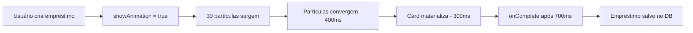
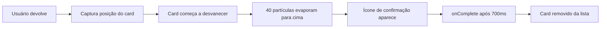

# 🎨 Sistema de Animações Minimalistas com Partículas

## 📋 Visão Geral

Implementação de animações minimalistas e fluidas para empréstimos e devoluções de ferramentas, usando efeitos de partículas com duração fixa de **700ms**.

---

## ✨ Funcionalidades

### 🎯 Duas Animações Principais

#### 1. **Animação de Empréstimo** 
- **Arquivo**: `EmprestimoParticleAnimation.jsx`
- **Duração**: 700ms (fixo)
- **Efeito**: Partículas se formam de pontos aleatórios e convergem para o centro, formando um card de empréstimo
- **Momento**: Quando um novo empréstimo é criado

#### 2. **Animação de Devolução**
- **Arquivo**: `DevolucaoParticleAnimation.jsx`
- **Duração**: 700ms (fixo)
- **Efeito**: Card evapora em partículas que sobem para o topo da tela
- **Momento**: Quando um empréstimo é devolvido

---

## 🔧 Características Técnicas

### ⏱️ Timeline Preciso - 700ms

Todas as animações são executadas em **exatamente 700 milissegundos**:

```javascript
// EmprestimoParticleAnimation.jsx
const completeTimeout = setTimeout(() => {
  if (onComplete) onComplete();
}, 700); // ⏰ 700ms fixo

// DevolucaoParticleAnimation.jsx
const completeTimeout = setTimeout(() => {
  if (onComplete) onComplete();
}, 700); // ⏰ 700ms fixo
```

### 🎨 Efeitos Visuais

#### Animação de Empréstimo:
- **30 partículas azuis** surgindo de posições aleatórias
- Partículas convergem para o centro da tela
- Card materializa com efeito 3D (rotateY)
- Brilho azul sutil no fundo
- Badges das ferramentas aparecem em sequência

#### Animação de Devolução:
- **40 partículas verdes** distribuídas em grid
- Partículas evaporam para cima
- 8 rastros de luz verde acompanhando partículas
- Ícone de confirmação (CheckCircle) aparece no centro
- 3 ondas de confirmação expandindo
- Brilho verde no fundo

---

## 📦 Componentes Criados

### 1. EmprestimoParticleAnimation.jsx

```jsx
import EmprestimoParticleAnimation from './EmprestimoParticleAnimation';

<EmprestimoParticleAnimation
  ferramentas={[
    { nome: 'Martelo', quantidade: 2 },
    { nome: 'Chave de Fenda', quantidade: 1 }
  ]}
  funcionarioNome="João Silva"
  funcionarioFoto="url-da-foto.jpg"
  onComplete={() => console.log('Animação completa!')}
/>
```

**Props:**
- `ferramentas`: Array com objetos `{ nome, quantidade }`
- `funcionarioNome`: Nome do funcionário
- `funcionarioFoto`: URL da foto (opcional)
- `onComplete`: Callback executado após 700ms

**Efeitos:**
- ✨ 30 partículas azuis convergindo
- 🎴 Card com avatar e ferramentas
- 💫 Efeito 3D de rotação
- 🌟 Brilho azul de fundo

### 2. DevolucaoParticleAnimation.jsx

```jsx
import DevolucaoParticleAnimation from './DevolucaoParticleAnimation';

<DevolucaoParticleAnimation
  emprestimo={emprestimoObj}
  ferramentasDevolvidas={[...]}
  cardElement={document.getElementById('card-id')}
  onComplete={() => console.log('Devolução animada!')}
/>
```

**Props:**
- `emprestimo`: Objeto do empréstimo completo
- `ferramentasDevolvidas`: Array de ferramentas devolvidas
- `cardElement`: Elemento DOM do card (para posição)
- `onComplete`: Callback executado após 700ms

**Efeitos:**
- 💚 40 partículas verdes evaporando
- 🌈 8 rastros de luz verde
- ✅ Ícone de confirmação centralizado
- 📡 3 ondas de confirmação
- 🌟 Brilho verde de fundo

---

## 🔌 Integração

### Arquivos Modificados

#### 1. NovoEmprestimo.jsx
```jsx
// Antes
import BoxLoanAnimation from './BoxLoanAnimation';

// Depois
import EmprestimoParticleAnimation from './EmprestimoParticleAnimation';

// Uso
{showAnimation && emprestimoParaAnimar && (
  <EmprestimoParticleAnimation
    ferramentas={emprestimoParaAnimar.ferramentas}
    funcionarioNome={emprestimoParaAnimar.funcionarioNome}
    funcionarioFoto={emprestimoParaAnimar.funcionarioFoto}
    onComplete={finalizarEmprestimo}
  />
)}
```

#### 2. ListaEmprestimos.jsx
```jsx
// Import adicionado
import DevolucaoParticleAnimation from './DevolucaoParticleAnimation';

// ID adicionado ao card
<motion.div
  id={`emprestimo-card-${emprestimo.id}`}
  ...
>

// Uso da animação
{showDevolucaoAnimation && dadosDevolucao && (
  <DevolucaoParticleAnimation
    emprestimo={dadosDevolucao.emprestimo}
    ferramentasDevolvidas={dadosDevolucao.ferramentasDevolvidas}
    cardElement={document.getElementById(`emprestimo-card-${dadosDevolucao.emprestimo.id}`)}
    onComplete={finalizarDevolucao}
  />
)}
```

---

## 🎯 Fluxo de Funcionamento

### Empréstimo (Criação)



### Devolução



---

## 🎨 Customização

### Ajustar Número de Partículas

```javascript
// EmprestimoParticleAnimation.jsx - linha ~28
const generatedParticles = Array.from({ length: 30 }, ...);
// Altere 30 para o número desejado

// DevolucaoParticleAnimation.jsx - linha ~26
const generatedParticles = Array.from({ length: 40 }, ...);
// Altere 40 para o número desejado
```

### Ajustar Cores

```javascript
// Empréstimo (Azul)
className="bg-blue-500"  // Partículas
className="border-blue-500"  // Card

// Devolução (Verde)
className="bg-green-500"  // Partículas
className="border-green-500"  // Card
```

### Ajustar Duração (⚠️ Não Recomendado)

```javascript
// Se REALMENTE precisar mudar os 700ms
const completeTimeout = setTimeout(() => {
  if (onComplete) onComplete();
}, 700); // ⚠️ Alterar aqui afeta sincronização

// Também ajustar transições do Framer Motion
transition={{
  duration: 0.7,  // 700ms em segundos
  ...
}}
```

---

## 💡 Detalhes de Implementação

### 1. Geração de Partículas Aleatórias

```javascript
// Empréstimo - partículas convergindo
const generatedParticles = Array.from({ length: 30 }, (_, i) => ({
  id: i,
  startX: Math.random() * 100,  // 0-100% da tela
  startY: Math.random() * 100,  // 0-100% da tela
  size: Math.random() * 4 + 2,  // 2-6px
  delay: Math.random() * 200,   // 0-200ms
  opacity: Math.random() * 0.5 + 0.5  // 0.5-1.0
}));
```

```javascript
// Devolução - partículas em grid evaporando
const generatedParticles = Array.from({ length: 40 }, (_, i) => {
  const gridX = (i % 8) * 12.5;  // 8 colunas
  const gridY = Math.floor(i / 8) * 20;  // 5 linhas
  
  return {
    id: i,
    startX: gridX + (Math.random() * 10 - 5),  // Com variação
    startY: gridY + (Math.random() * 10 - 5),
    endY: gridY - (Math.random() * 400 + 200),  // Sobe 200-600px
    ...
  };
});
```

### 2. Captura de Posição do Card

```javascript
// DevolucaoParticleAnimation - linha ~18
if (cardElement) {
  const rect = cardElement.getBoundingClientRect();
  setCardData({
    x: rect.left,
    y: rect.top,
    width: rect.width,
    height: rect.height
  });
}
```

### 3. Timeline Sincronizado

```javascript
// Empréstimo
useEffect(() => {
  // Partículas: 0-700ms
  setParticles(generatedParticles);
  
  // Card aparece: 400ms
  setTimeout(() => setShowCard(true), 400);
  
  // Completa: 700ms
  setTimeout(() => onComplete(), 700);
}, []);
```

---

## 🎭 Estados da Animação

### Empréstimo

| Tempo | Estado | Descrição |
|-------|--------|-----------|
| 0ms | Início | Componente monta, gera partículas |
| 0-200ms | Spawn | Partículas surgem com delay aleatório |
| 200-500ms | Convergência | Partículas voam para o centro |
| 400ms | Card Aparece | Card materializa com rotação 3D |
| 500-700ms | Finalização | Partículas desaparecem, card estabiliza |
| 700ms | Complete | `onComplete()` chamado |

### Devolução

| Tempo | Estado | Descrição |
|-------|--------|-----------|
| 0ms | Início | Captura posição do card |
| 0-300ms | Desvanecimento | Card começa a ficar transparente |
| 0-700ms | Evaporação | 40 partículas sobem |
| 200-700ms | Rastros | 8 rastros de luz verde |
| 200-500ms | Confirmação | Ícone verde aparece centralizado |
| 200-700ms | Ondas | 3 ondas de confirmação expandem |
| 700ms | Complete | `onComplete()` chamado |

---

## 🚀 Performance

### Otimizações Implementadas

1. **Número Limitado de Partículas**
   - Empréstimo: 30 partículas
   - Devolução: 40 partículas + 8 rastros
   - Total máximo: 48 elementos animados

2. **Duração Fixa**
   - Evita loops infinitos
   - Previne acúmulo de animações

3. **Cleanup Automático**
   ```javascript
   return () => {
     clearTimeout(timeline);
     clearTimeout(completeTimeout);
   };
   ```

4. **AnimatePresence**
   - Remove elementos do DOM após animação
   - Libera memória automaticamente

5. **z-index Controlado**
   ```jsx
   className="fixed inset-0 z-[100]"
   ```
   - Garante que animação fica acima de tudo
   - Não interfere com outros elementos

---

## 🐛 Troubleshooting

### Problema: Animação não aparece

**Solução 1**: Verificar se o Framer Motion está instalado
```bash
npm install framer-motion
```

**Solução 2**: Verificar se o componente está recebendo `onComplete`
```jsx
<EmprestimoParticleAnimation
  onComplete={() => console.log('Completo')}  // ✅ Obrigatório
/>
```

### Problema: Card da devolução não evapora da posição correta

**Solução**: Garantir que o card tem ID correto
```jsx
<motion.div
  id={`emprestimo-card-${emprestimo.id}`}  // ✅ ID único
>
```

### Problema: Animação muito rápida/lenta

**Solução**: Verificar se não há múltiplas instâncias
```javascript
// Garantir que só existe uma animação ativa
{showAnimation && <EmprestimoParticleAnimation />}
```

### Problema: Partículas não aparecem

**Solução 1**: Verificar z-index da animação
```css
z-[100]  /* Deve estar acima de tudo */
```

**Solução 2**: Verificar se há overflow hidden nos parents
```css
/* Remover overflow: hidden dos containers pais */
```

---

## 📊 Métricas

### Empréstimo

- **Partículas**: 30
- **Duração Total**: 700ms
- **FPS Target**: 60fps
- **Elementos DOM**: ~35 (30 partículas + card + fundo)

### Devolução

- **Partículas**: 40
- **Rastros**: 8
- **Ondas**: 3
- **Duração Total**: 700ms
- **FPS Target**: 60fps
- **Elementos DOM**: ~52 (40 + 8 + 3 + card + ícone)

---

## 🎓 Boas Práticas

### ✅ Fazer

- Sempre fornecer `onComplete` callback
- Usar IDs únicos nos cards
- Manter duração em 700ms
- Testar em diferentes tamanhos de tela

### ❌ Não Fazer

- Não alterar duração sem atualizar todos os timeouts
- Não criar múltiplas instâncias simultâneas
- Não remover AnimatePresence
- Não adicionar mais de 50 partículas (performance)

---

## 🔮 Melhorias Futuras

### Possíveis Aprimoramentos

1. **Som de Feedback**
   ```javascript
   const playSound = () => new Audio('/sounds/whoosh.mp3').play();
   ```

2. **Vibração (Mobile)**
   ```javascript
   if ('vibrate' in navigator) {
     navigator.vibrate(50);
   }
   ```

3. **Tema Customizado**
   ```javascript
   const theme = {
     emprestimo: { color: 'blue', particles: 30 },
     devolucao: { color: 'green', particles: 40 }
   };
   ```

4. **Diferentes Tipos de Partículas**
   ```javascript
   // Estrelas, círculos, quadrados, etc.
   const shapes = ['circle', 'star', 'square'];
   ```

5. **Trail Effect Mais Elaborado**
   ```javascript
   // Partículas deixando rastro colorido
   ```

---

## 📚 Referências

### Framer Motion
- [Documentação Oficial](https://www.framer.com/motion/)
- [AnimatePresence](https://www.framer.com/motion/animate-presence/)
- [useAnimation](https://www.framer.com/motion/use-animation/)

### CSS
- [Transform 3D](https://developer.mozilla.org/en-US/docs/Web/CSS/transform)
- [Backdrop Filter](https://developer.mozilla.org/en-US/docs/Web/CSS/backdrop-filter)

---

## 📝 Changelog

### v1.0.0 - 13/10/2025
- ✨ Implementação inicial
- 🎨 30 partículas para empréstimo
- 💚 40 partículas para devolução
- ⏱️ Duração fixa de 700ms
- 🎯 Integração com NovoEmprestimo e ListaEmprestimos

---

**Criado em**: 13 de outubro de 2025  
**Versão**: 1.0.0  
**Desenvolvedor**: Sistema WorkFlow
