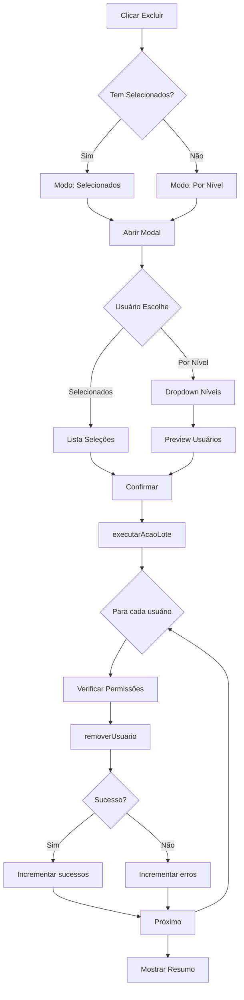

# 🗑️ Exclusão de Usuários por Nível de Permissão

## 📋 Visão Geral

Foi implementada uma funcionalidade avançada de exclusão de usuários que permite remover múltiplos usuários de uma vez, seja por seleção manual ou por nível de permissão (cargo).

## ✨ Funcionalidades

### 🎯 Dois Modos de Exclusão

#### 1. **Usuários Selecionados** (Modo Padrão)
- Excluir usuários manualmente selecionados na lista
- Permite escolher especificamente quais usuários remover
- Ideal para exclusões pontuais

#### 2. **Por Nível de Permissão** (Novo)
- Excluir TODOS os usuários de um determinado nível/cargo
- Seleção por dropdown com contador de usuários
- Preview em tempo real dos usuários que serão excluídos
- Ideal para limpeza em massa

## 🔧 Como Usar

### Acesso ao Modo Exclusão por Nível

1. **Navegar para**: Usuários > Sistema
2. **Clicar em**: Botão "Excluir Selecionados" (vermelho)
3. **Selecionar**: Modo "Por Nível de Permissão"

### Passo a Passo - Exclusão por Nível

```
1. Abrir modal de exclusão
   └─ Clicar no botão "Excluir Selecionados"

2. Escolher modo de exclusão
   └─ Clicar no card "Por Nível de Permissão"

3. Selecionar nível de permissão
   └─ Escolher no dropdown (mostra contador)
   └─ Exemplo: "Funcionário (37 usuários)"

4. Revisar usuários que serão excluídos
   └─ Lista com preview (primeiros 10)
   └─ Contador total na lista

5. Confirmar exclusão
   └─ Clicar em "Excluir X Usuário(s)"
```

### Passo a Passo - Exclusão por Seleção

```
1. Ativar modo seleção
   └─ Clicar em "Ativar Seleção Múltipla"

2. Selecionar usuários manualmente
   └─ Clicar nas checkboxes dos usuários
   └─ Ou usar "Selecionar Todos"

3. Abrir modal de exclusão
   └─ Clicar em "Excluir Selecionados"

4. Modo já está em "Usuários Selecionados"
   └─ Revisar lista

5. Confirmar exclusão
   └─ Clicar em "Excluir X Selecionado(s)"
```

## 🎨 Interface

### Cards de Seleção de Modo

```
┌─────────────────────────┬─────────────────────────┐
│  👤 Usuários            │  🛡️ Por Nível de       │
│     Selecionados        │     Permissão          │
│                         │                         │
│  5 selecionado(s)       │  Excluir por cargo     │
└─────────────────────────┴─────────────────────────┘
```

### Dropdown de Níveis

```
┌─────────────────────────────────────────┐
│ Selecione um nível                    ▼ │
├─────────────────────────────────────────┤
│ Administrador (37 usuários)             │
│ Gerente Geral (5 usuários)              │
│ Gerente de Setor (12 usuários)          │
│ Supervisor (8 usuários)                 │
│ Funcionário (37 usuários)               │
└─────────────────────────────────────────┘
```

### Preview de Usuários

```
┌─────────────────────────────────────────────────────┐
│ Usuários que serão excluídos (37):                  │
├─────────────────────────────────────────────────────┤
│ ┌──────────────────────────────────────────┐        │
│ │ [A] Admin 1          [Funcionário]       │        │
│ │     admin1                               │        │
│ └──────────────────────────────────────────┘        │
│ ┌──────────────────────────────────────────┐        │
│ │ [A] Admin 2          [Funcionário]       │        │
│ │     admin2                               │        │
│ └──────────────────────────────────────────┘        │
│ ...                                                  │
│ +27 mais...                                          │
└─────────────────────────────────────────────────────┘
```

## ⚠️ Avisos de Segurança

### Validações Implementadas

1. **Verificação de Permissões**
   - Respeita hierarquia de permissões
   - Usuário só pode excluir níveis inferiores

2. **Preview Obrigatório**
   - Sempre mostra quem será excluído
   - Contador em tempo real

3. **Confirmação Explícita**
   - Aviso vermelho de ação irreversível
   - Botão desabilitado até seleção válida

4. **Mensagens Claras**
   ```
   ⚠️ ATENÇÃO: Esta ação é irreversível!
   Todos os usuários com o nível de permissão 
   selecionado serão excluídos permanentemente.
   ```

## 🔒 Casos de Uso

### 1. Limpar Admins Duplicados Criados Incorretamente
```javascript
// Cenário: Rotação criou múltiplos admins com nível funcionário
Modo: Por Nível de Permissão
Nível: Funcionário
Resultado: Remove todos os funcionários de uma vez
```

### 2. Remover Usuários de Teste
```javascript
// Cenário: Após testes, remover contas temporárias
Modo: Usuários Selecionados
Seleção: Marcar manualmente os usuários de teste
Resultado: Remove apenas os selecionados
```

### 3. Reestruturação de Hierarquia
```javascript
// Cenário: Mudar estrutura organizacional
Modo: Por Nível de Permissão
Nível: Supervisor
Resultado: Remove todos os supervisores para recriar
```

## 📊 Estatísticas e Feedback

### Mensagens de Sucesso
```
✅ 37 usuário(s) processado(s) com sucesso!
```

### Mensagens de Erro
```
❌ 5 usuário(s) não puderam ser processados
```

### Informações no Console
```javascript
console.log(`Excluindo usuário ${usuarioId}...`);
// Para cada usuário processado
```

## 🛡️ Proteções Implementadas

### 1. Não Permite Excluir Próprio Usuário
```javascript
if (usuarioLogado.id === usuarioId) {
  erros++;
  continue;
}
```

### 2. Validação de Hierarquia
```javascript
if (!PermissionChecker.canEditUser(
  usuarioLogado.nivel, 
  usuarioLogado.id, 
  usuarioId, 
  usuario.nivel
)) {
  erros++;
  continue;
}
```

### 3. Tratamento de Erros Individual
```javascript
try {
  await removerUsuario(usuarioId);
  sucessos++;
} catch (error) {
  console.error(`Erro ao processar ${usuarioId}:`, error);
  erros++;
}
```

## 📝 Código Principal

### Estado do Formulário
```javascript
const [formAcaoLote, setFormAcaoLote] = useState({
  empresaId: '',
  setorId: '',
  nivelPermissao: '',
  modoExclusao: 'selecionados' // 'selecionados' ou 'porNivel'
});
```

### Lógica de Exclusão
```javascript
// Determinar quais usuários processar
if (formAcaoLote.modoExclusao === 'porNivel') {
  // Excluir por nível de permissão
  usuariosParaProcessar = usuarios.filter(
    u => u.nivel === parseInt(formAcaoLote.nivelPermissao)
  );
} else {
  // Usar usuários selecionados
  usuariosParaProcessar = usuariosSelecionados
    .map(id => usuarios.find(u => u.id === id))
    .filter(Boolean);
}
```

### Contador Dinâmico
```javascript
{Object.entries(NIVEIS_LABELS).map(([nivel, label]) => {
  const count = usuarios.filter(
    u => u.nivel === parseInt(nivel)
  ).length;
  return (
    <option key={nivel} value={nivel}>
      {label} ({count} usuário{count !== 1 ? 's' : ''})
    </option>
  );
})}
```

## 🎯 Níveis de Permissão

### Hierarquia Completa

| Nível | Código | Permissão              |
|-------|--------|------------------------|
| 0     | ADMIN  | Administrador          |
| 1     | GG     | Gerente Geral          |
| 2     | GS     | Gerente de Setor       |
| 3     | SUP    | Supervisor             |
| 4     | FUNC   | Funcionário            |

## 🔄 Fluxo de Dados



## 🚀 Melhorias Futuras

### Possíveis Aprimoramentos

1. **Exportar Lista Antes de Excluir**
   - Gerar CSV com usuários que serão excluídos
   - Backup automático

2. **Exclusão Suave (Soft Delete)**
   - Marcar como inativo ao invés de excluir
   - Possibilidade de restauração

3. **Agendamento de Exclusão**
   - Agendar exclusão para data/hora específica
   - Notificações aos usuários afetados

4. **Filtros Avançados**
   - Excluir por empresa + nível
   - Excluir por data de criação
   - Excluir inativos há X dias

5. **Auditoria Detalhada**
   - Log de quem excluiu
   - Quando excluiu
   - Quantos excluiu
   - Nível dos excluídos

## 📚 Arquivos Relacionados

- `src/components/usuarios/UsuariosTab.jsx` - Componente principal
- `src/constants/permissoes.js` - Definições de níveis
- `src/hooks/useAuth.js` - Hook de autenticação
- `docs/FIX_ADMIN_DUPLICADO_ROTACAO.md` - Contexto do problema

## 🎓 Boas Práticas

### Recomendações de Uso

1. ✅ **Sempre revisar** a lista de preview antes de confirmar
2. ✅ **Fazer backup** antes de exclusões em massa
3. ✅ **Testar primeiro** em ambiente de desenvolvimento
4. ✅ **Documentar** motivo da exclusão em massa
5. ❌ **Nunca excluir** sem verificar o impacto

### Quando Usar Cada Modo

**Use "Usuários Selecionados":**
- Exclusões pontuais
- Casos específicos
- Menos de 10 usuários

**Use "Por Nível de Permissão":**
- Limpeza em massa
- Reestruturação organizacional
- Remover todos de um cargo

## ⚡ Performance

### Otimizações Implementadas

1. **Processamento Assíncrono**
   ```javascript
   for (const usuario of usuariosParaProcessar) {
     await removerUsuario(usuario.id);
   }
   ```

2. **Preview Limitado**
   ```javascript
   .slice(0, 10) // Mostra apenas 10 primeiros
   ```

3. **Contador Eficiente**
   ```javascript
   usuarios.filter(u => u.nivel === parseInt(nivel)).length
   ```

## 🐛 Troubleshooting

### Problemas Comuns

1. **Botão desabilitado**
   - ✓ Verifique se selecionou um nível válido
   - ✓ Verifique se há usuários no nível escolhido

2. **Erro ao excluir**
   - ✓ Verifique suas permissões
   - ✓ Não pode excluir níveis superiores ou iguais

3. **Usuários não aparecem**
   - ✓ Verifique se existem usuários naquele nível
   - ✓ Recarregue a lista de usuários

## 📞 Suporte

Se encontrar problemas ou tiver sugestões:
1. Verifique este documento primeiro
2. Consulte os logs do console
3. Reporte bugs com detalhes do erro

---

**Documentação criada em**: 13 de outubro de 2025  
**Versão**: 1.0  
**Autor**: Sistema de Gerenciamento WorkFlow
