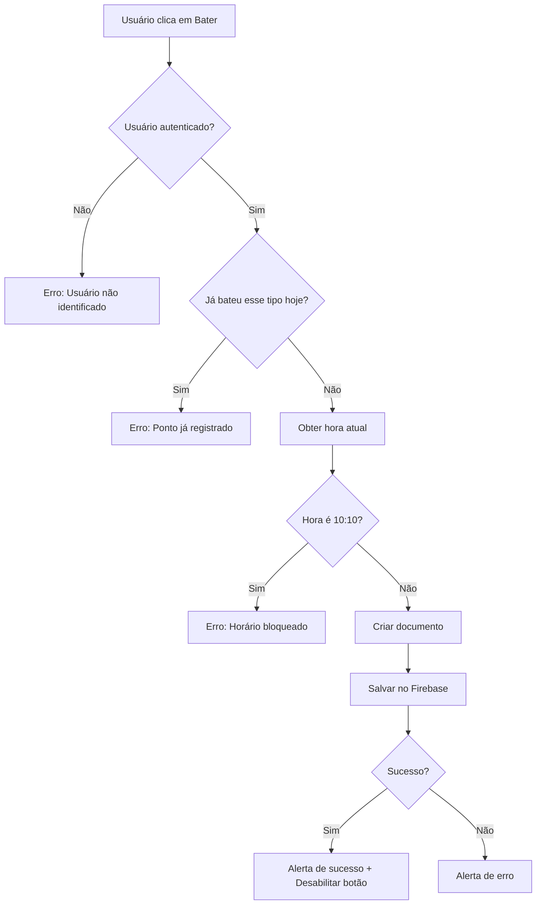

# 📋 Estrutura da Coleção de Pontos - Firebase

## 🗂️ Nome da Coleção
**`pontos`** - Coleção dedicada exclusivamente para registro de pontos eletrônicos

---

## 📊 Estrutura dos Documentos

Cada documento na coleção `pontos` possui os seguintes campos:

### Campos Obrigatórios

| Campo | Tipo | Descrição | Exemplo |
|-------|------|-----------|---------|
| `funcionarioId` | `string` | ID único do funcionário no sistema | `"user123"` ou `"abc-def-ghi"` |
| `funcionarioNome` | `string` | Nome completo do funcionário | `"João Silva"` |
| `tipo` | `string` | Tipo do ponto registrado | `"entrada"`, `"saida_almoco"`, `"retorno_almoco"`, `"saida"` |
| `data` | `string` (ISO 8601) | Data e hora do registro em formato ISO | `"2025-10-07T14:30:00.000Z"` |
| `timestamp` | `number` | Timestamp Unix em milissegundos | `1728315000000` |

---

## 🎯 Tipos de Ponto Válidos

A coleção aceita apenas 4 tipos de pontos por dia:

1. **`entrada`** - Início do Trabalho (1º ponto do dia)
2. **`saida_almoco`** - Saída para Almoço (2º ponto do dia)
3. **`retorno_almoco`** - Retorno do Almoço (3º ponto do dia)
4. **`saida`** - Saída do Trabalho (4º ponto do dia)

---

## 📝 Exemplo de Documento

```json
{
  "funcionarioId": "user123",
  "funcionarioNome": "João Silva",
  "tipo": "entrada",
  "data": "2025-10-07T08:15:30.000Z",
  "timestamp": 1728287730000
}
```

---

## 🛡️ Regras de Validação

### Validações Automáticas no Frontend

O sistema aplica as seguintes validações ANTES de salvar:

#### ✅ Validações de Horário
- **Bloqueia horário 10:10** - Não permite registro exatamente às 10:10 (problema conhecido)
- **Bloqueia horário 00:00** - Não permite registros à meia-noite
- **Bloqueia horário inválido** - Não permite `--:--` ou datas corrompidas

#### ✅ Validações de Duplicata
- **1 ponto por tipo/dia** - Cada tipo só pode ser registrado uma vez por dia
- **Ordem lógica** - Sistema valida se já bateu o ponto antes de permitir registro

#### ✅ Validações de Data
- **Data válida** - Verifica se a data é válida e no formato correto
- **Não permite futuros** - Sistema usa sempre a hora atual (`new Date()`)

---

## 🔥 Regras de Segurança do Firestore

As regras aplicadas na collection `pontos`:

```javascript
match /pontos/{pontoId} {
  // Leitura: Qualquer usuário autenticado pode ler
  allow read: if request.auth != null;
  
  // Criação: Usuários autenticados podem criar com validação
  allow create: if request.auth != null 
    && request.resource.data.funcionarioId is string
    && request.resource.data.tipo in ['entrada', 'saida_almoco', 'retorno_almoco', 'saida']
    && request.resource.data.data is string
    && request.resource.data.timestamp is number;
  
  // Atualização e Exclusão: Apenas administradores
  allow update, delete: if request.auth != null 
    && get(/databases/$(database)/documents/usuarios/$(request.auth.uid)).data.nivel == 'admin';
}
```

---

## 🗑️ Sistema de Limpeza Automática

### Filtros Automáticos (Invisível para o Usuário)

O sistema IGNORA automaticamente ao carregar:
- ❌ Pontos com mais de 30 dias
- ❌ Pontos sem data válida
- ❌ Pontos sem tipo definido
- ❌ Pontos com horário 00:00
- ❌ Pontos com horário 10:10 (problema conhecido)
- ❌ Pontos com horário `--:--`

### Limpeza Manual

Dois botões disponíveis na interface:

#### 🟠 Botão "Limpar 10:10"
- **Ação:** Deleta TODOS os pontos às 10:10 de TODOS os usuários
- **Uso:** Corrigir problema específico de pontos às 10:10
- **Permissão:** Qualquer usuário autenticado
- **Confirmação:** Sim (com aviso de ação irreversível)

#### 🔴 Botão "Limpar Inválidos"
- **Ação:** Deleta pontos inválidos do usuário logado
- **Remove:**
  - Pontos sem data/tipo
  - Pontos com mais de 30 dias
  - Pontos com horário inválido (00:00, --:--, 10:10)
- **Permissão:** Apenas do próprio usuário
- **Confirmação:** Sim

---

## 📊 Consultas e Índices

### Consulta Principal (Pontos de Hoje)

```javascript
const q = query(
  collection(db, 'pontos'),
  where('funcionarioId', '==', String(userId))
);
```

### Consulta de Histórico (Últimos 30 dias)

O mesmo query acima, mas com filtro adicional no frontend para remover pontos antigos.

### Índices Necessários

**Índice Composto:**
- `funcionarioId` (Ascending)
- `timestamp` (Descending)

---

## 🔄 Fluxo de Registro de Ponto



---

## 📈 Monitoramento e Logs

O sistema gera logs detalhados no console:

### Logs de Carregamento
```
🔥 Firebase DB inicializado: true
👤 Usuário logado: {id: "...", nome: "..."}
📋 Total de pontos encontrados: 5
📌 Ponto VÁLIDO encontrado: {tipo: "entrada", data: "07/10/2025", horario: "08:15"}
✅ entrada registrado para hoje: 08:15
```

### Logs de Validação
```
⚠️ Ponto com horário inválido/problemático: doc123 10:10
⚠️ Ponto muito antigo (>30 dias): doc456 05/09/2025
🗑️ Histórico: Removendo ponto sem horário válido: doc789
```

### Logs de Registro
```
⏰ Batendo ponto: {tipo: "entrada", horario: "08:15", usuario: "João"}
✅ Ponto registrado com sucesso! {id: "doc123", tipo: "entrada", horario: "08:15"}
```

### Logs de Limpeza
```
🧹 Iniciando limpeza de pontos às 10:10...
📋 Total de pontos no sistema: 150
🗑️ Deletado ponto às 10:10: doc123 (entrada, 05/10/2025)
✅ Limpeza de 10:10 concluída! 12 pontos removidos.
```

---

## 🚨 Problemas Conhecidos e Soluções

### ❌ Problema: Pontos às 10:10 bloqueando botões

**Causa:** Pontos antigos ou de teste registrados às 10:10

**Solução:**
1. Clicar no botão laranja "Limpar 10:10"
2. Confirmar a limpeza
3. Atualizar a página (F5)
4. Botões ficam disponíveis novamente

### ❌ Problema: Histórico com pontos antigos

**Causa:** Pontos com mais de 30 dias acumulados

**Solução:**
1. Clicar no botão vermelho "Limpar Inválidos"
2. Confirmar a limpeza
3. Sistema remove automaticamente pontos >30 dias

### ❌ Problema: Botão não registra ponto

**Possíveis causas:**
1. Usuário não está autenticado
2. Já bateu esse tipo de ponto hoje
3. Horário atual é exatamente 10:10
4. Erro de conexão com Firebase

**Solução:**
1. Abrir console (F12)
2. Verificar logs de erro (❌)
3. Verificar autenticação (👤)
4. Tentar novamente após 1 minuto se for 10:10

---

## 📌 Boas Práticas

### Para Desenvolvedores

1. **Sempre validar dados** antes de salvar
2. **Usar timestamps** para ordenação precisa
3. **Filtrar dados antigos** automaticamente
4. **Logs detalhados** para debug
5. **Confirmação** antes de deletar dados

### Para Administradores

1. **Backup regular** da coleção pontos
2. **Monitorar logs** de erros
3. **Limpar dados antigos** mensalmente
4. **Verificar regras** de segurança periodicamente

### Para Usuários

1. **Bater ponto** no horário correto
2. **Verificar** se o ponto foi registrado
3. **Não tentar** bater duplicado
4. **Reportar** problemas imediatamente

---

## 🔧 Manutenção

### Limpeza Recomendada

| Frequência | Ação | Método |
|------------|------|--------|
| Diária | Verificar logs de erro | Console do navegador |
| Semanal | Verificar pontos inválidos | Botão "Limpar Inválidos" |
| Mensal | Arquivar pontos antigos | Script de backup + limpeza |
| Anual | Revisar regras de segurança | Firebase Console |

---

## 📞 Suporte

Em caso de problemas:
1. Abrir console do navegador (F12)
2. Copiar logs com emojis 🔥📌❌
3. Enviar para equipe de desenvolvimento
4. Incluir horário e ação realizada

---

**Última atualização:** 07/10/2025  
**Versão:** 2.0  
**Autor:** Sistema WorkPonto
