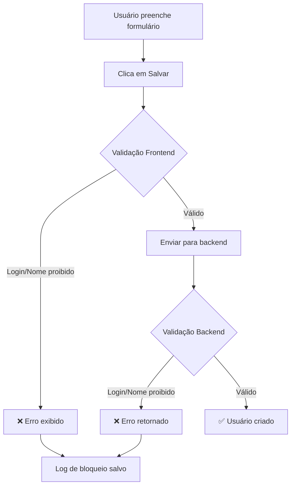
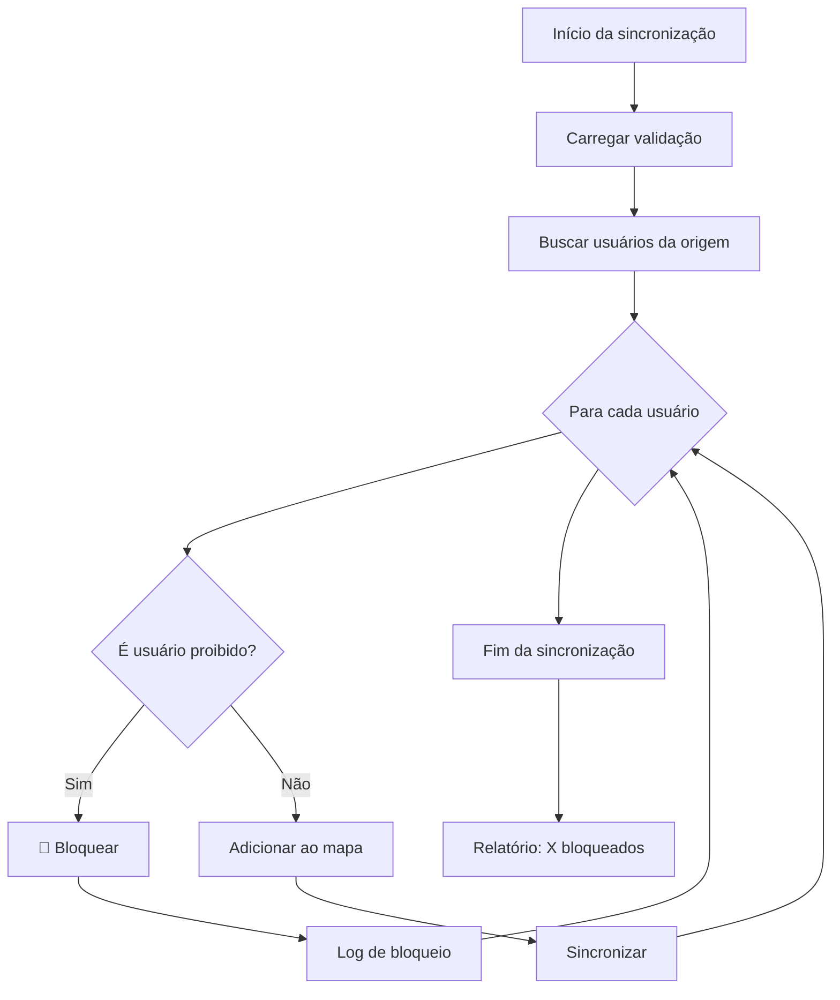
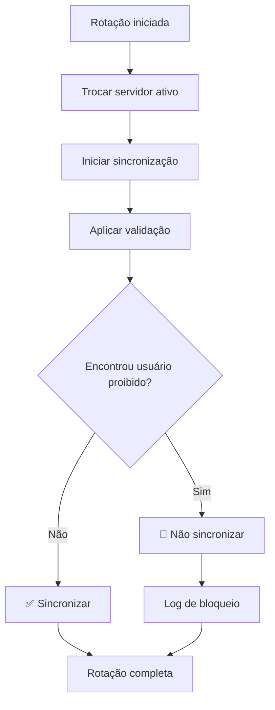

# 🛡️ Sistema de Bloqueio de Usuários Admin

## 📋 Visão Geral

Sistema completo de validação e bloqueio que impede a criação de usuários com login "admin" ou variações em **todos os pontos** do sistema, incluindo:

- ✅ Criação manual de usuários
- ✅ Sincronização entre servidores
- ✅ Rotação de servidores
- ✅ Cópia de coleções
- ✅ Importação de dados

## 🎯 Objetivo

Prevenir a criação de múltiplos usuários admin duplicados que causavam problemas de permissão e acesso, especialmente durante processos automáticos de sincronização e rotação de servidores.

## 🔒 Logins Bloqueados

### Lista Completa de Termos Proibidos

**Logins:**
- `admin`
- `administrator`
- `administrador`
- `root`
- `superuser`
- `super`
- `system`
- `sistema`

**Nomes:**
- `administrador`
- `administrator`
- `admin`
- `root`
- `system`
- `sistema`

### Regras de Bloqueio

1. **Exatamente igual** (case-insensitive)
   ```javascript
   "admin" → ❌ Bloqueado
   "ADMIN" → ❌ Bloqueado
   "Admin" → ❌ Bloqueado
   ```

2. **Contém o termo**
   ```javascript
   "admin123" → ❌ Bloqueado
   "myadmin" → ❌ Bloqueado
   "admin_user" → ❌ Bloqueado
   ```

3. **Variações com números/caracteres**
   ```javascript
   "admin1" → ❌ Bloqueado (remove números e verifica)
   "admin_2" → ❌ Bloqueado
   ```

## 📁 Arquivos do Sistema

### 1. `src/utils/validacaoUsuarios.js`
**Utilidade central de validação**

```javascript
import { 
  validarLogin, 
  validarNome,
  validarDadosUsuario,
  deveBloquearNaSincronizacao,
  logBloqueio
} from '../utils/validacaoUsuarios';
```

**Funções Principais:**

#### `validarLogin(login)`
Valida se o login é permitido.

```javascript
const resultado = validarLogin('admin');
// {
//   valido: false,
//   erro: '❌ Login "admin" está bloqueado por segurança...'
// }
```

#### `validarNome(nome)`
Valida se o nome é permitido.

```javascript
const resultado = validarNome('Administrador');
// {
//   valido: false,
//   erro: '❌ Nome "Administrador" está bloqueado por segurança...'
// }
```

#### `validarDadosUsuario(dados)`
Valida login E nome ao mesmo tempo.

```javascript
const resultado = validarDadosUsuario({
  usuario: 'admin',
  nome: 'João Silva'
});
// {
//   valido: false,
//   erros: ['❌ Login "admin" está bloqueado...']
// }
```

#### `deveBloquearNaSincronizacao(userData)`
Verifica se usuário deve ser bloqueado durante sincronização.

```javascript
const bloqueado = deveBloquearNaSincronizacao({
  usuario: 'admin',
  nome: 'Administrador'
});
// true - Este usuário será bloqueado
```

#### `logBloqueio(contexto, dados)`
Registra tentativa de criação bloqueada.

```javascript
logBloqueio('criação manual', {
  usuario: 'admin',
  nome: 'Administrador',
  nivel: 0
});
// Salvo no localStorage para auditoria
```

### 2. `src/components/Workflow.jsx`
**Validação na criação manual**

```javascript
const criarUsuario = async (dadosUsuario) => {
  // 🛡️ Validação antes de criar
  const { validarDadosUsuario, logBloqueio } = 
    await import('../utils/validacaoUsuarios');
  
  const validacao = validarDadosUsuario(dadosUsuario);
  
  if (!validacao.valido) {
    logBloqueio('criação manual', dadosUsuario);
    return { 
      success: false, 
      message: validacao.erros.join('\n')
    };
  }
  
  // Continuar com criação...
};
```

### 3. `src/components/usuarios/UsuariosTab.jsx`
**Validação no formulário**

```javascript
const salvarUsuario = async () => {
  // 🛡️ Validação no frontend
  const { validarDadosUsuario } = 
    await import('../../utils/validacaoUsuarios');
  
  const validacao = validarDadosUsuario({
    usuario: formData.usuario,
    nome: formData.nome
  });

  if (!validacao.valido) {
    setErro(validacao.erros.join('\n'));
    return;
  }
  
  // Continuar com salvamento...
};
```

### 4. `src/services/firebaseSync.js`
**Validação na sincronização e cópia**

#### Na função `syncCollection()`

```javascript
async syncCollection(collectionName, timestampField = 'dataCriacao') {
  // 🛡️ Importar validação
  let validacaoUsuarios = null;
  if (collectionName === 'usuarios') {
    validacaoUsuarios = await import('../utils/validacaoUsuarios.js');
  }

  // Mapear documentos com bloqueio
  sourceSnapshot.forEach(docSnapshot => {
    const data = docSnapshot.data();
    
    // 🛡️ Bloquear usuários proibidos
    if (collectionName === 'usuarios' && validacaoUsuarios) {
      if (validacaoUsuarios.deveBloquearNaSincronizacao(data)) {
        validacaoUsuarios.logBloqueio('sincronização', data);
        return; // Não adicionar ao mapa
      }
    }
    
    sourceMap.set(docSnapshot.id, { id: docSnapshot.id, data });
  });
  
  // ... resto da lógica
}
```

#### Na função `copyCollection()`

```javascript
async copyCollection(collectionName, options = {}) {
  // 🛡️ Importar validação
  let validacaoUsuarios = null;
  if (collectionName === 'usuarios') {
    validacaoUsuarios = await import('../utils/validacaoUsuarios.js');
  }

  // Copiar com bloqueio
  for (const docSnapshot of snapshot.docs) {
    const docData = docSnapshot.data();
    
    // 🛡️ Bloquear usuários proibidos
    if (collectionName === 'usuarios' && validacaoUsuarios) {
      if (validacaoUsuarios.deveBloquearNaSincronizacao(docData)) {
        validacaoUsuarios.logBloqueio('cópia de coleção', docData);
        blocked++;
        continue; // Pular este documento
      }
    }
    
    // Continuar com cópia...
  }
}
```

## 🔄 Fluxos de Validação

### 1. Criação Manual de Usuário



### 2. Sincronização de Servidores



### 3. Rotação de Servidores



## 📊 Sistema de Auditoria

### Logs de Bloqueio

Cada bloqueio é registrado com:

```javascript
{
  timestamp: '2025-10-13T10:30:45.123Z',
  contexto: 'sincronização',
  usuario: 'admin',
  nome: 'Administrador',
  nivel: 0,
  motivo: 'Login ou nome contém termo bloqueado'
}
```

### Armazenamento

- **Local**: `localStorage.bloqueios_usuarios`
- **Limite**: 100 últimos registros
- **Acesso**: Via funções de estatísticas

### Funções de Auditoria

#### `getEstatisticasBloqueios()`
Retorna estatísticas dos bloqueios.

```javascript
const stats = getEstatisticasBloqueios();
// {
//   total: 47,
//   porContexto: {
//     'criação manual': 5,
//     'sincronização': 37,
//     'cópia de coleção': 5
//   },
//   ultimos10: [...]
// }
```

#### `limparLogsBloqueios()`
Limpa todos os logs de bloqueio.

```javascript
limparLogsBloqueios();
// ✅ Logs de bloqueios limpos
```

## 🎨 Mensagens de Erro

### Para Usuários Finais

```
❌ Login "admin" está bloqueado por segurança. 
   Use um nome de usuário diferente.
```

```
❌ Login não pode conter "admin". 
   Use um nome de usuário diferente.
```

```
❌ Nome "Administrador" está bloqueado por segurança. 
   Use um nome diferente.
```

### Nos Logs do Console

```javascript
🚫 [Sincronização] Bloqueando usuário com login proibido: admin
```

```javascript
🚫 [BLOQUEIO DE USUÁRIO] {
  timestamp: '2025-10-13T10:30:45.123Z',
  contexto: 'criação manual',
  usuario: 'admin',
  nome: 'Administrador'
}
```

## 🔍 Como Testar

### 1. Teste Manual de Criação

```javascript
// No formulário de usuários
Login: "admin" → ❌ Deve ser bloqueado
Login: "admin123" → ❌ Deve ser bloqueado
Login: "joao" → ✅ Deve funcionar

Nome: "Administrador" → ❌ Deve ser bloqueado
Nome: "João Silva" → ✅ Deve funcionar
```

### 2. Teste de Sincronização

```javascript
// 1. Criar usuário "admin" direto no Firebase Console
// 2. Executar sincronização
// 3. Verificar console:
//    🚫 Bloqueando usuário com login proibido: admin
// 4. Verificar que o usuário NÃO foi sincronizado
```

### 3. Verificar Logs

```javascript
// No console do navegador
import { getEstatisticasBloqueios } from './utils/validacaoUsuarios';
console.log(getEstatisticasBloqueios());
```

## 📈 Resultados Esperados

### Antes do Sistema

```
❌ 37 usuários "admin" duplicados
❌ Todos com nível "funcionário" (incorreto)
❌ Criados automaticamente durante rotação
❌ Problemas de acesso e permissão
```

### Depois do Sistema

```
✅ Impossível criar usuário "admin"
✅ Bloqueio em todos os pontos do sistema
✅ Logs de auditoria de tentativas
✅ Sincronização segura
```

## 🛠️ Manutenção

### Adicionar Novo Termo Bloqueado

Editar `src/utils/validacaoUsuarios.js`:

```javascript
const LOGINS_PROIBIDOS = [
  'admin',
  'administrator',
  // ... existentes
  'novo_termo_proibido' // Adicionar aqui
];
```

### Personalizar Mensagens de Erro

Editar funções em `validacaoUsuarios.js`:

```javascript
return {
  valido: false,
  erro: `Sua mensagem personalizada aqui`
};
```

### Alterar Limite de Logs

Na função `logBloqueio()`:

```javascript
// Manter apenas últimos 100 registros
if (bloqueios.length > 100) { // Alterar este número
  bloqueios.shift();
}
```

## 🔐 Segurança

### Camadas de Proteção

1. **Frontend (UsuariosTab)**
   - Validação imediata no formulário
   - Feedback visual instantâneo

2. **Backend (Workflow)**
   - Validação antes de gravar
   - Última linha de defesa manual

3. **Sincronização (FirebaseSync)**
   - Bloqueio durante transferência entre servidores
   - Previne propagação de dados inválidos

4. **Auditoria**
   - Logs de todas as tentativas
   - Rastreabilidade completa

### Bypass Prevention

❌ **NÃO é possível burlar** porque:

1. Validação em múltiplos pontos
2. Import dinâmico garante código atualizado
3. Logs de auditoria rastreiam tentativas
4. Bloqueio case-insensitive
5. Detecta variações e substrings

## 📚 Documentos Relacionados

- `docs/FIX_ADMIN_DUPLICADO_ROTACAO.md` - Problema original
- `docs/EXCLUIR_USUARIOS_POR_NIVEL.md` - Limpeza de duplicados
- `scripts/limpar-admins-duplicados.js` - Script de limpeza

## 🎯 Casos de Uso

### 1. Prevenir Criação Manual

```javascript
// Usuário tenta criar "admin" no formulário
→ ❌ Bloqueado no frontend
→ ❌ Bloqueado no backend (se burlar frontend)
→ 📝 Log registrado
```

### 2. Prevenir Durante Sincronização

```javascript
// Rotação detecta novo servidor com usuário "admin"
→ 🔍 Validação identifica termo bloqueado
→ 🚫 Não adiciona ao mapa de sincronização
→ ✅ Servidor rotaciona sem usuário proibido
→ 📝 Log registrado
```

### 3. Prevenir Durante Cópia

```javascript
// Backup detecta usuário "admin" para copiar
→ 🔍 Validação antes de adicionar ao batch
→ 🚫 Pula este documento
→ ✅ Cópia continua sem usuário proibido
→ 📝 Log registrado
```

## ✅ Checklist de Implementação

- [x] Criar `validacaoUsuarios.js`
- [x] Adicionar validação em `Workflow.jsx`
- [x] Adicionar validação em `UsuariosTab.jsx`
- [x] Adicionar validação em `firebaseSync.js` (syncCollection)
- [x] Adicionar validação em `firebaseSync.js` (copyCollection)
- [x] Sistema de logs de auditoria
- [x] Funções de estatísticas
- [x] Mensagens de erro claras
- [x] Documentação completa
- [x] Testes de validação

## 🚀 Próximos Passos

1. ✅ Sistema implementado e funcionando
2. 📝 Monitorar logs de bloqueio
3. 📊 Analisar tentativas bloqueadas
4. 🔄 Ajustar lista de termos se necessário
5. 📈 Avaliar efetividade após 1 semana

---

**Implementado em**: 13 de outubro de 2025  
**Versão**: 1.0  
**Status**: ✅ Ativo e funcionando
