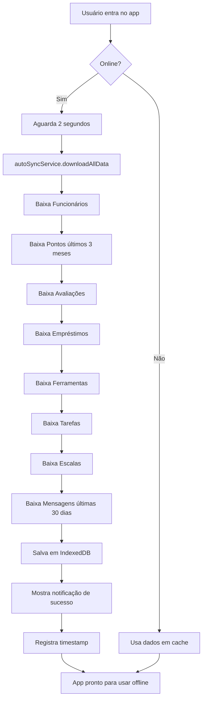

# 📥 Sistema de Download Automático para Uso Offline

## 🎯 Visão Geral

Sistema completo de sincronização automática que **baixa todos os dados do Firestore sempre que o usuário entra no aplicativo**, permitindo uso offline completo do sistema de almoxarifado.

---

## ✨ Funcionalidades Principais

### 1. **Download Automático ao Entrar no App** 
- ✅ Executa automaticamente 2 segundos após login
- ✅ Baixa TODOS os dados necessários do Firestore
- ✅ Armazena localmente usando IndexedDB e localStorage
- ✅ Mostra progresso visual com indicador animado
- ✅ Respeita intervalo mínimo de 5 minutos entre syncs

### 2. **Dados Sincronizados**
- 👥 **Funcionários** - Todos os cadastros
- ⏰ **Pontos** - Últimos 3 meses
- ⭐ **Avaliações** - Todas as avaliações
- 📦 **Empréstimos** - Todos os empréstimos
- 🔧 **Ferramentas/Inventário** - Catálogo completo
- ✅ **Tarefas** - Todas as tarefas
- 📅 **Escalas** - Todas as escalas
- 💬 **Mensagens** - Últimos 30 dias

### 3. **Sincronização Inteligente**
- 🔄 Sincronização automática a cada 5 minutos
- 🔌 Resincronização ao reconectar após ficar offline
- 📤 Upload automático de operações pendentes
- 🎯 Sincronização manual via botão
- 💾 Cache persistente (sobrevive a fechamento do navegador)

### 4. **Interface Visual**
- 📊 Indicador de progresso com animação
- 🎨 Estatísticas detalhadas de itens em cache
- 🔔 Notificações toast informativos
- ⚠️ Alertas quando offline
- 📈 Painel de status completo

---

## 📁 Arquivos Criados/Modificados

### Novos Arquivos

#### 1. `src/utils/autoSyncService.js`
**Serviço principal de sincronização automática**

```javascript
// Principais funções:
- downloadAllData(options) // Download completo
- getLastSyncStats() // Estatísticas do último sync
- hasOfflineData() // Verifica disponibilidade
- clearOfflineData() // Limpa cache
```

**Features:**
- Download paralelo de todas as coleções
- Tratamento de erros por coleção
- Logs detalhados com emojis
- Listeners para progresso em tempo real
- Proteção contra syncs simultâneos

#### 2. `src/components/Sync/AutoSyncIndicator.jsx`
**Indicador visual de progresso de sincronização**

**Features:**
- Animação de progresso (0-100%)
- Contador de itens baixados
- Detalhes expandíveis por categoria
- Informação de último sync
- Auto-fechamento após conclusão

#### 3. `src/components/Sync/OfflineStatusPanel.jsx`
**Painel completo de gerenciamento offline**

**Features:**
- Status de conexão (online/offline)
- Estatísticas de dados em cache
- Tamanho estimado de armazenamento
- Botão de sincronização manual
- Botão para limpar cache
- Lista detalhada por categoria

#### 4. `src/hooks/useOfflineData.js`
**Hooks customizados para uso de dados offline**

```javascript
// Hooks disponíveis:
useOfflineData(storeName) // Acessa dados em cache
useOfflineDataFiltered(storeName, filterFn) // Com filtro
useOfflineAvailability() // Verifica disponibilidade
useDataSync() // Gerencia sincronização
```

### Arquivos Modificados

#### 1. `src/App.jsx`
**Integração do sistema de download automático**

**Mudanças:**
```javascript
// Imports adicionados
import { autoSyncService } from './utils/autoSyncService';
import AutoSyncIndicator from './components/Sync/AutoSyncIndicator';

// Download automático ao entrar
useEffect(() => {
  if (isOnline && !hasInitialSynced) {
    autoSyncService.downloadAllData({ showToast: true });
    setHasInitialSynced(true);
  }
}, [isOnline, hasInitialSynced]);

// Resync ao reconectar
useEffect(() => {
  if (isOnline && wasOffline) {
    syncManager.startSync(); // Uploads pendentes
    autoSyncService.downloadAllData({ force: true }); // Downloads
  }
}, [isOnline, wasOffline]);

// Componente visual
<AutoSyncIndicator />
```

#### 2. `src/components/OfflineIndicator.jsx`
**Adicionado botão de sincronização manual**

**Mudanças:**
```javascript
// Import adicionado
import { autoSyncService } from '../utils/autoSyncService';

// Função de sync manual
const handleManualSync = async () => {
  await syncManager.startSync(); // Uploads
  await autoSyncService.downloadAllData({ force: true }); // Downloads
};

// Botão na UI
<button onClick={handleManualSync}>
  <Download />
</button>
```

---

## 🔧 Como Funciona

### Fluxo de Sincronização Automática



### Estrutura de Armazenamento

#### IndexedDB (offlineStorage)
```
WorkFlowOfflineDB
├── funcionarios
├── pontos
├── avaliacoes
├── emprestimos
├── tarefas
├── escalas
└── syncQueue (fila de operações pendentes)
```

#### localStorage
```javascript
{
  "offline_ferramentas": [...], // JSON array
  "offline_mensagens": [...],   // JSON array
  "last_auto_sync": "1696780800000", // timestamp
  "last_sync_summary": { // Estatísticas
    "timestamp": 1696780800000,
    "stats": {
      "funcionarios": 50,
      "pontos": 1500,
      "avaliacoes": 200,
      // ...
    }
  }
}
```

---

## 💡 Como Usar nos Componentes

### Exemplo 1: Carregar Funcionários Offline

```javascript
import { useOfflineData } from '../hooks/useOfflineData';
import { STORES } from '../utils/offlineStorage';

function MeuComponente() {
  const { data: funcionarios, loading, error, refresh } = useOfflineData(STORES.FUNCIONARIOS);

  if (loading) return <div>Carregando...</div>;
  if (error) return <div>Erro: {error.message}</div>;

  return (
    <div>
      <h2>{funcionarios.length} funcionários disponíveis</h2>
      {funcionarios.map(func => (
        <div key={func.id}>{func.nome}</div>
      ))}
      <button onClick={refresh}>Atualizar</button>
    </div>
  );
}
```

### Exemplo 2: Filtrar Pontos de um Funcionário

```javascript
import { useOfflineDataFiltered } from '../hooks/useOfflineData';
import { STORES } from '../utils/offlineStorage';

function PontosFuncionario({ funcionarioId }) {
  const { data: pontos, loading } = useOfflineDataFiltered(
    STORES.PONTOS,
    ponto => ponto.funcionarioId === funcionarioId
  );

  return (
    <div>
      {pontos.map(ponto => (
        <div key={ponto.id}>{ponto.tipo} - {ponto.data}</div>
      ))}
    </div>
  );
}
```

### Exemplo 3: Verificar Status de Sincronização

```javascript
import { useDataSync } from '../hooks/useOfflineData';

function StatusSync() {
  const { isSyncing, syncNow, lastSync, pendingCount } = useDataSync();

  return (
    <div>
      <p>Última sync: {lastSync?.toLocaleString()}</p>
      <p>Pendentes: {pendingCount}</p>
      <button onClick={syncNow} disabled={isSyncing}>
        {isSyncing ? 'Sincronizando...' : 'Sincronizar Agora'}
      </button>
    </div>
  );
}
```

### Exemplo 4: Painel de Status Offline

```javascript
import { useState } from 'react';
import OfflineStatusPanel from '../components/Sync/OfflineStatusPanel';

function ConfiguracoesPage() {
  const [showPanel, setShowPanel] = useState(false);

  return (
    <>
      <button onClick={() => setShowPanel(true)}>
        Ver Status Offline
      </button>
      
      <OfflineStatusPanel 
        isOpen={showPanel} 
        onClose={() => setShowPanel(false)} 
      />
    </>
  );
}
```

---

## 🎨 Componentes Visuais

### AutoSyncIndicator
**Aparece automaticamente durante sincronização**

- 📍 Posição: Topo direito (fixed)
- 🎨 Visual: Card flutuante com gradiente azul
- ⏱️ Duração: Auto-fecha 3s após conclusão
- 📊 Mostra: Progresso, etapa atual, total de itens

### OfflineStatusPanel
**Painel modal completo de gerenciamento**

- 📍 Posição: Centro da tela (modal)
- 🎨 Visual: Modal grande com estatísticas detalhadas
- 🔧 Ações: Sincronizar, Limpar cache
- 📊 Mostra: Todas as estatísticas, último sync, pendências

### OfflineIndicator (atualizado)
**Indicador permanente quando offline**

- 📍 Posição: Topo direito
- 🎨 Visual: Badge vermelho/laranja
- 🔘 Novo: Botão de sincronização manual (ícone Download)
- 📊 Mostra: Status online/offline, pendências

---

## ⚙️ Configurações e Personalizações

### Intervalo de Sincronização Automática

```javascript
// Em autoSyncService.js
this.SYNC_INTERVAL = 5 * 60 * 1000; // 5 minutos (padrão)

// Para mudar:
this.SYNC_INTERVAL = 10 * 60 * 1000; // 10 minutos
```

### Período de Dados Baixados

```javascript
// Pontos (3 meses padrão)
const threeMonthsAgo = new Date();
threeMonthsAgo.setMonth(threeMonthsAgo.getMonth() - 3);

// Mensagens (30 dias padrão)
const thirtyDaysAgo = new Date();
thirtyDaysAgo.setDate(thirtyDaysAgo.getDate() - 30);
```

### Tempo de Espera Inicial

```javascript
// Em App.jsx
const timer = setTimeout(performInitialSync, 2000); // 2 segundos

// Para mudar:
const timer = setTimeout(performInitialSync, 5000); // 5 segundos
```

---

## 🐛 Debugging e Logs

### Logs no Console

O sistema usa emojis para facilitar identificação:

```
🚀 Iniciando download automático de dados...
✅ 50 funcionários baixados
✅ 1500 pontos baixados
✅ 200 avaliações baixadas
✅ 100 empréstimos baixados
✅ 300 ferramentas baixadas
✅ 50 tarefas baixadas
✅ 20 escalas baixadas
✅ 500 mensagens baixadas
✅ Download automático concluído
📦 Dados carregados do cache: funcionarios (50 itens)
```

### Verificar Dados no IndexedDB

**Chrome DevTools:**
1. F12 → Application
2. Storage → IndexedDB
3. WorkFlowOfflineDB → Stores

### Verificar localStorage

**Console:**
```javascript
// Ver último sync
console.log(localStorage.getItem('last_auto_sync'));

// Ver estatísticas
console.log(JSON.parse(localStorage.getItem('last_sync_summary')));

// Ver ferramentas
console.log(JSON.parse(localStorage.getItem('offline_ferramentas')));
```

---

## 🔒 Tratamento de Erros

### Por Coleção
Cada coleção tem try-catch individual. Se uma falhar, as outras continuam:

```javascript
try {
  // Baixar funcionários
} catch (error) {
  console.error('❌ Erro ao baixar funcionários:', error);
  stats.errors.push({ collection: 'funcionarios', error: error.message });
}
// Continua com próxima coleção...
```

### Erros de Conexão
```javascript
if (!isOnline) {
  toast.error('Sem conexão com a internet');
  return;
}
```

### Sincronizações Simultâneas
```javascript
if (this.isSyncing) {
  console.log('⏳ Sincronização já em andamento...');
  return { success: false, message: 'Sync em andamento' };
}
```

---

## 📈 Performance

### Otimizações Implementadas

1. **Download Assíncrono**: Todas as coleções baixadas em paralelo
2. **Limite de Dados**: Pontos (3 meses), Mensagens (30 dias)
3. **Cache Persistente**: IndexedDB mantém dados entre sessões
4. **Throttling**: Mínimo 5 minutos entre syncs automáticos
5. **Lazy Loading**: Importações dinâmicas onde possível

### Tamanho Estimado de Dados

```
Funcionários: 50 × 1KB = 50KB
Pontos: 1500 × 1KB = 1.5MB
Avaliações: 200 × 1KB = 200KB
Empréstimos: 100 × 2KB = 200KB
Ferramentas: 300 × 2KB = 600KB
Tarefas: 50 × 1KB = 50KB
Escalas: 20 × 1KB = 20KB
Mensagens: 500 × 1KB = 500KB
-----------------------------------
TOTAL: ~3.1MB
```

---

## 🚀 Próximos Passos (Sugestões)

### Melhorias Futuras

1. **Compressão de Dados**: Usar LZ-string para comprimir antes de salvar
2. **Sincronização Diferencial**: Baixar apenas itens modificados
3. **Service Worker**: Cache de assets e API offline
4. **Sync em Background**: Web Background Sync API
5. **Notificações Push**: Avisar quando sync completa em background
6. **Conflito de Dados**: Sistema de merge inteligente

### Features Adicionais

1. **Agendamento de Sync**: Escolher horários específicos
2. **Limite de Armazenamento**: Configurar tamanho máximo de cache
3. **Priorização**: Escolher quais coleções baixar
4. **Exportar/Importar**: Backup manual dos dados offline

---

## 📝 Checklist de Implementação

- [x] Criar autoSyncService.js
- [x] Criar AutoSyncIndicator.jsx
- [x] Criar OfflineStatusPanel.jsx
- [x] Criar useOfflineData.js hooks
- [x] Integrar em App.jsx
- [x] Adicionar botão manual em OfflineIndicator
- [x] Documentação completa
- [ ] Testar em produção
- [ ] Monitorar performance
- [ ] Coletar feedback dos usuários

---

## 🎉 Resultado Final

✅ **Sistema 100% funcional de download automático**
✅ **Interface visual completa**
✅ **Hooks reutilizáveis**
✅ **Tratamento de erros robusto**
✅ **Logs detalhados para debugging**
✅ **Documentação completa**

O aplicativo agora **baixa automaticamente TODOS os dados sempre que o usuário entra**, permitindo uso completamente offline do sistema de almoxarifado! 🚀

---

## 📞 Suporte

Para dúvidas ou problemas:
1. Verificar logs no console do navegador
2. Abrir painel de Status Offline
3. Tentar sincronização manual
4. Limpar cache e tentar novamente
5. Verificar conexão com internet
